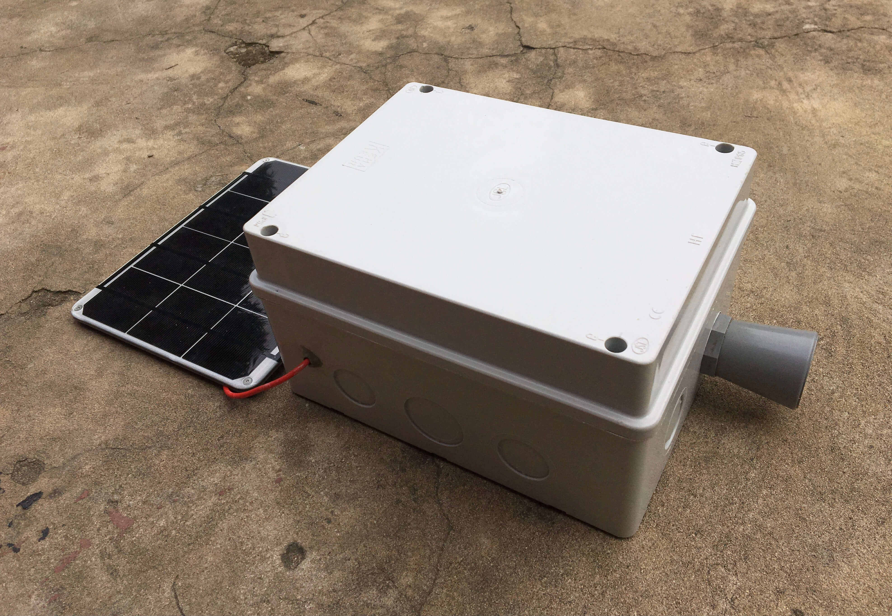
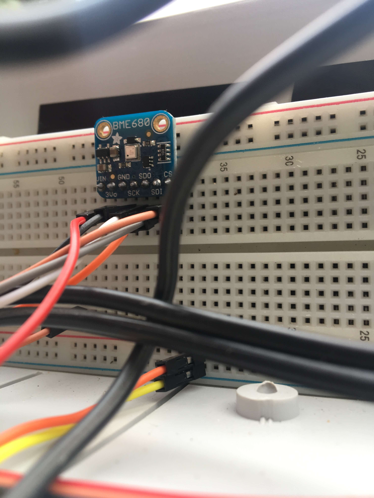

# Mareógrafo: Telemetric Hydrographic Station

### Design and Construction of a Telemetric Hydrographic Station (Autonomous, remote and in real time)

> **Original title (in Portuguese):**\
> Desenho e Construção de uma Estação Hidrográfica Telemétrica (Autónoma e Remota em Tempo Real)

This project was presented as part of the [`(📄 PDF) 3rd call for Scientific Initiation Scholarships in Mozambique, 2018`](./docs/edital-bic-2018.pdf) by [Kishan Jadav](https://kishanjadav.com) a student of _1st Year Civil Engineering_ at Universidade Save and supervised by [Eng. Gorka Solana](https://github.com/gorsol) in collaboration with the research and extension group _Open Source Science Hardware (OSSHW) of UniSave, the IT department of Universidade Save_ as well as the IT Department of [ARA Sul – Maxixe](https://www.ara-sul.gov.mz/).

## About

The need for a river monitoring system emerges as one of the forms of prevention and early warning against floods that may occur in lowland areas, affecting various populations and animals, as well as the surrounding infrastructure. Until then, in some places in Mozambique, a millimeter ruler is being used which forces locomotion to these places in order to make the appropriate measurements.

The development of this autonomous monitoring system with the transmission of information in real time through GPRS does not require locomotion to some of these remote or difficult-to-reach places and also allows obtaining a greater amount of data.

In this project we explore the use of an Arduino microcontroller, powered by solar panel and attached to it are GPRS, Ultrasonic and Temperature and Humidity modules, all enclosed inside an [IP-66 rated](https://www.mpl.ch/info/IPratings.html)) box.

The system architecture is of low cost and power.

-   [`(📄 PDF) Read the final project (in portuguese)`](./docs/mareografo.pdf)
-   [`(📄 PDF) Read the activity log of the project (in portuguese)`](./docs/mareografo-activity-log.pdf)

## Gallery

|                    Enclosure                     |                    Interior modules wiring                     |        Solar Panel attached        |
| :----------------------------------------------: | :------------------------------------------------------------: | :--------------------------------: |
|  |  |  |

|                      Solar panel test                      |
| :--------------------------------------------------------: |
|  |

|                  GPRS module attached to arduino                  |                    Humidity sensor                    |
| :---------------------------------------------------------------: | :---------------------------------------------------: |
|  |  |

## Usage and Installation

0. Wire up all the modules to the Arduino (maybe using a Protoboard - see `Mareografo.ino` for PIN instructions)
   
1. Make sure you have the required libraries installed:
    - [`SoftwareSerial`](https://www.arduino.cc/en/Reference/softwareSerial) <small>Used by the GPRS module.</small>
    - [`Adafruit FONA Library`](https://github.com/adafruit/Adafruit_FONA) <small>Used by the GPRS module.</small>
    - [`Wire`](https://www.arduino.cc/en/reference/wire) <small>Used by the Humidity sensor module.</small>
    - [`SPI`](https://www.arduino.cc/en/reference/SPI) <small>Used by the Humidity sensor module.</small>
    - [`Adafruit Unified Sensor Driver`](https://github.com/adafruit/Adafruit_Sensor) <small>Used by the Humidity sensor module.</small>
    - [`Adafruit BME680 Library`](https://github.com/adafruit/Adafruit_BME680) <small>Used by the Humidity sensor module.</small>
    - [`Arduino Maxbotix Library`](https://github.com/Diaoul/arduino-Maxbotix) <small>Used by the Ultrasonic sensor module.</small>
2. Upload the `Mareografo.ino` sketch into the arduino using the [`Arduino IDE`](https://www.arduino.cc/en/software).

## Authors

[`👤 Kishan Jadav`](https://github.com/kishannareshpal)
[`👤 Eng. Gorka Solana Arteche`](https://github.com/gorsol)
